# Price Action Trading Terminal — Application Flow Diagram

## 1. High-Level Architecture

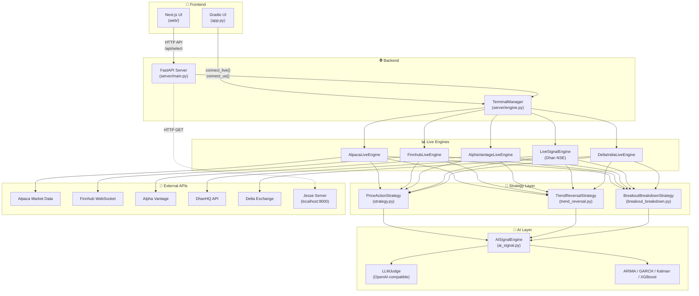

---

## 2. Application Startup Flow

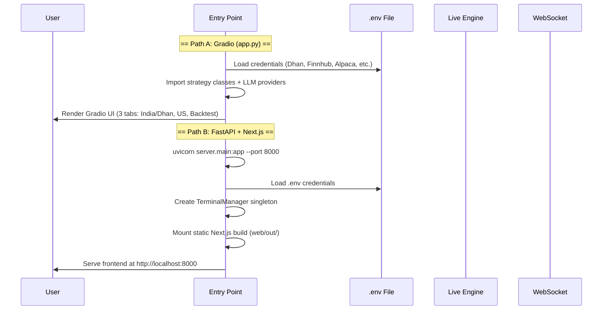

---

## 3. Symbol Selection & Engine Startup Flow

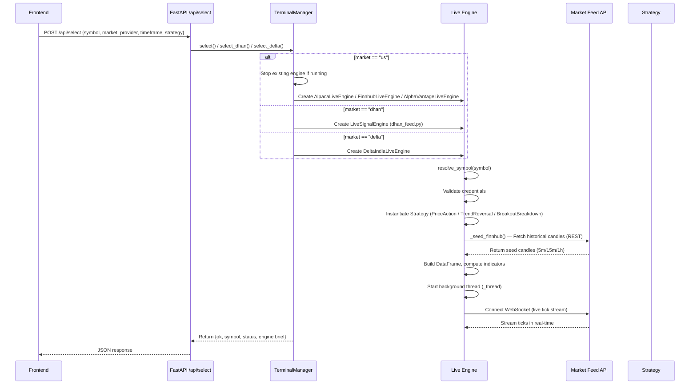

---

## 4. Live Data Stream & Candle Build Flow

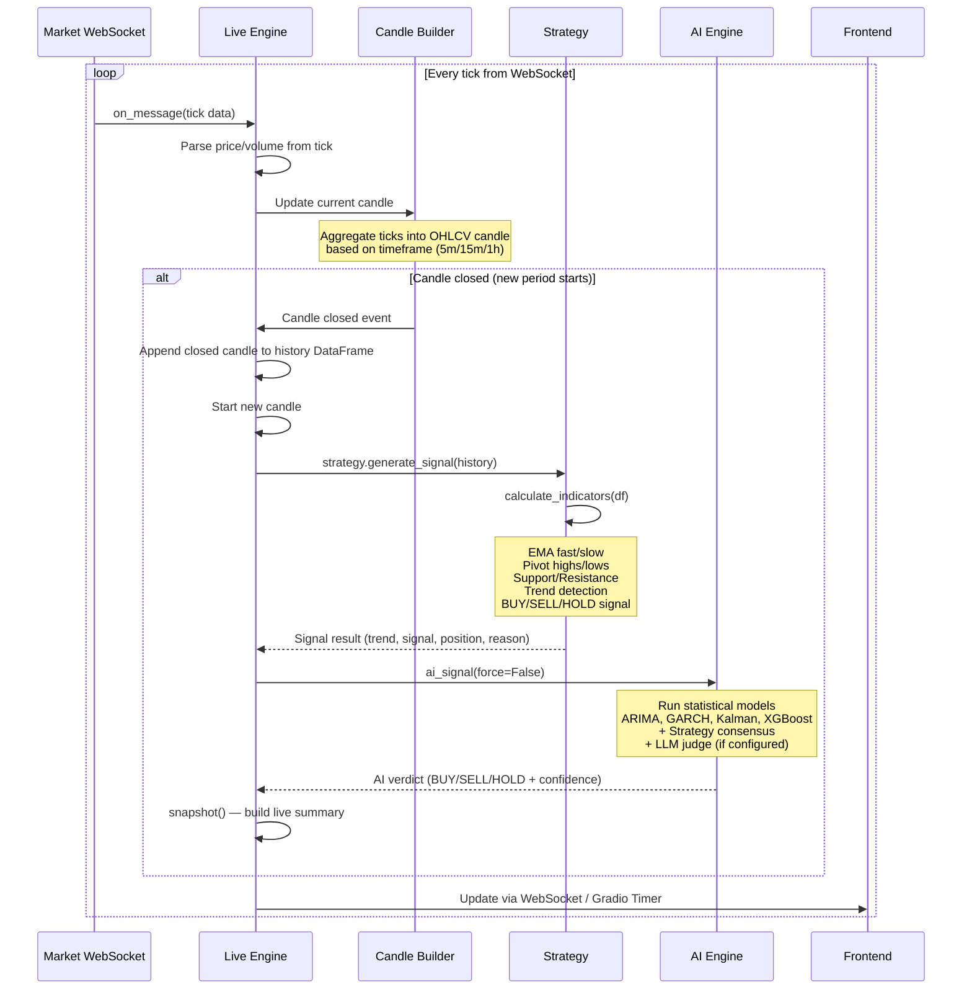

---

## 5. WebSocket Real-Time Push Flow

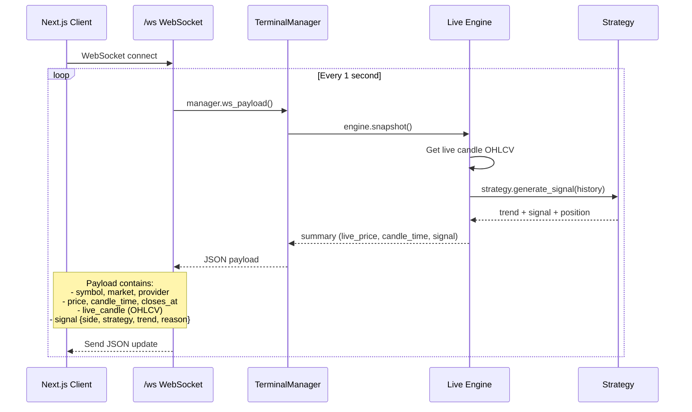

---

## 6. AI Signal Generation Flow

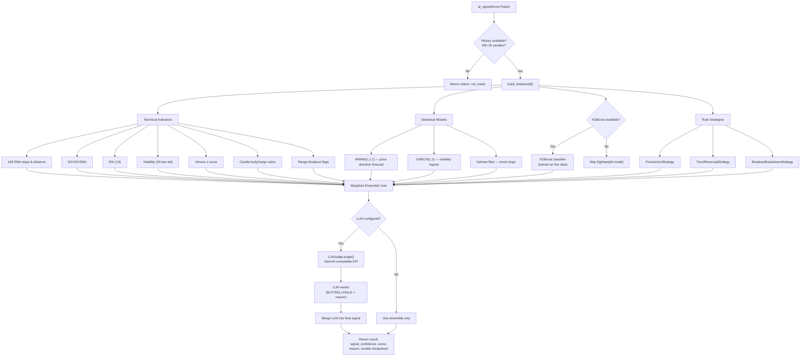

---

## 7. Dhan (India Market) Specific Flow

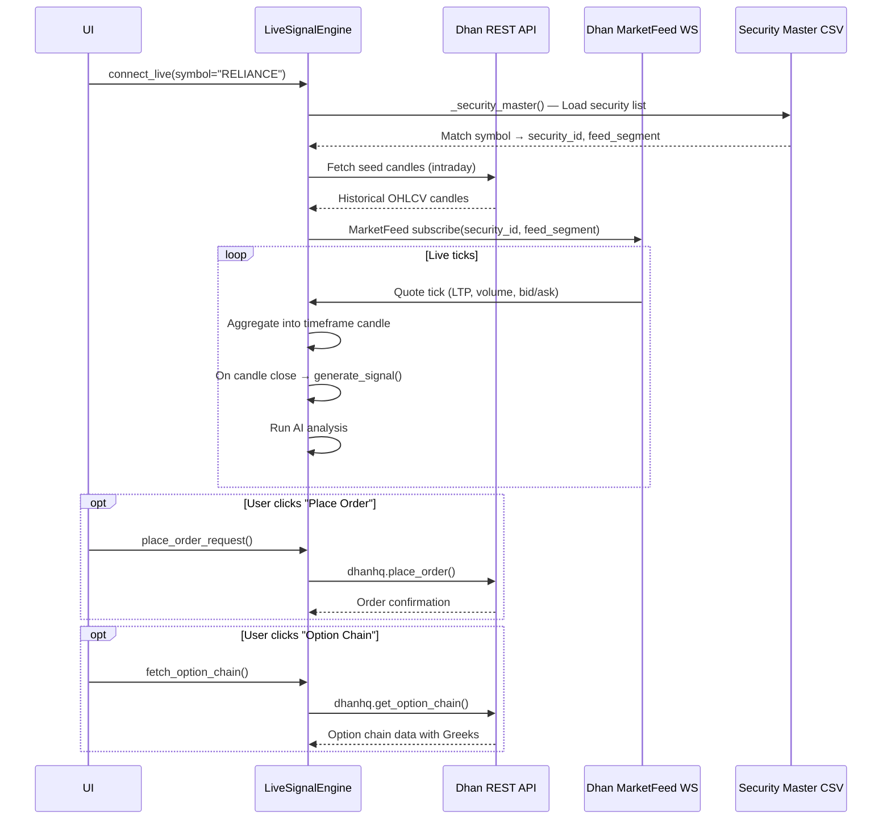

---

## 8. Complete REST API Endpoint Map

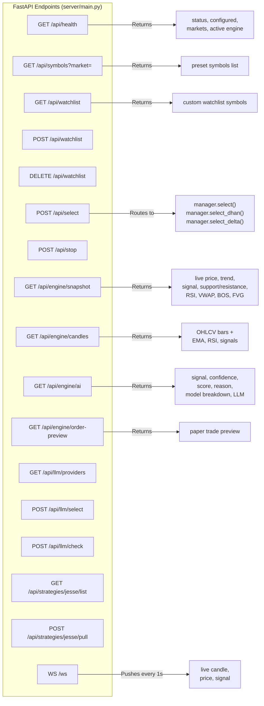

---

## 9. Gradio UI Tab Flow (app.py)

```mermaid
flowchart TB
    subgraph "Tab 1: India / Dhan"
        I1["User selects symbol<br/>(RELIANCE, NIFTY 50, etc.)"]
        I2["User clicks Connect"]
        I3["connect_live() → LiveSignalEngine"]
        I4["Engine streams Dhan ticks"]
        I5["Timer polls snapshot every 1s"]
        I6["Display: Trend, Signal,<br/>Price, Support/Resistance"]
        I7["Place Order / Option Chain<br/>(Dhan broker integration)"]
    end

    subgraph "Tab 2: US Market"
        U1["User selects symbol<br/>(AAPL, TSLA, NVDA, etc.)"]
        U2["User selects provider<br/>(Alpaca / Finnhub / AlphaVantage)"]
        U3["connect_us() → AlpacaLiveEngine<br/>/ FinnhubLiveEngine"]
        U4["Engine streams US ticks"]
        U5["Timer polls snapshot every 1s"]
        U6["Display: Trend, Signal,<br/>Price, Indicators"]
    end

    subgraph "Tab 3: Backtest CSV"
        B1["User uploads CSV file"]
        B2["User selects strategy"]
        B3["run_strategy() → strategy.generate_signal()"]
        B4["Display: Summary, DataFrame,<br/>Trend/Signal badge"]
    end

    I1 --> I2 --> I3 --> I4 --> I5 --> I6 --> I7
    U1 --> U2 --> U3 --> U4 --> U5 --> U6
    B1 --> B2 --> B3 --> B4
```

---

## 10. Module Dependency Map

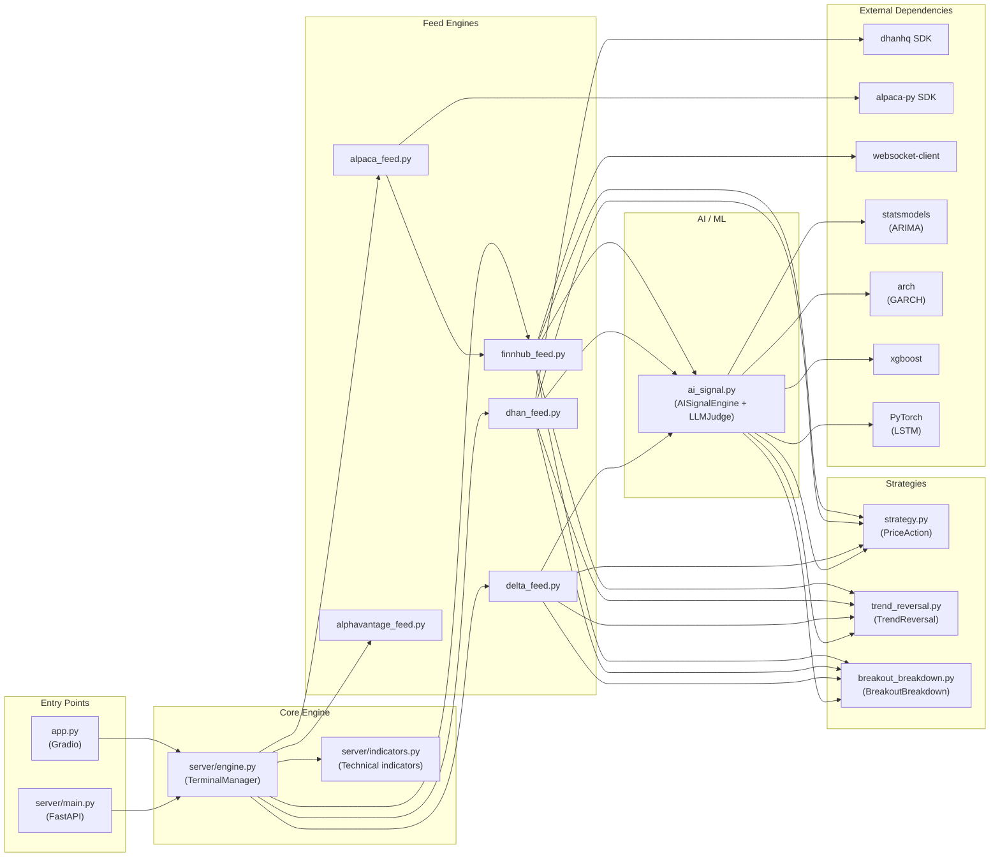

---

## 11. Complete Request Lifecycle

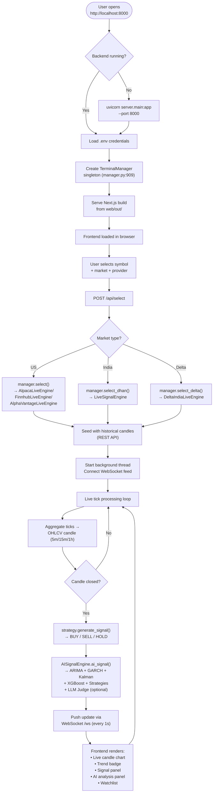

---

## 12. Signal Decision Tree

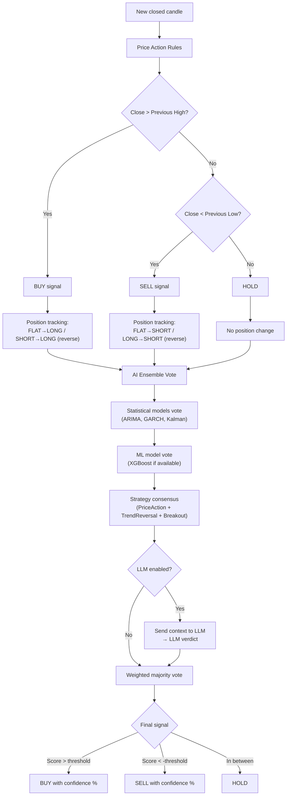
